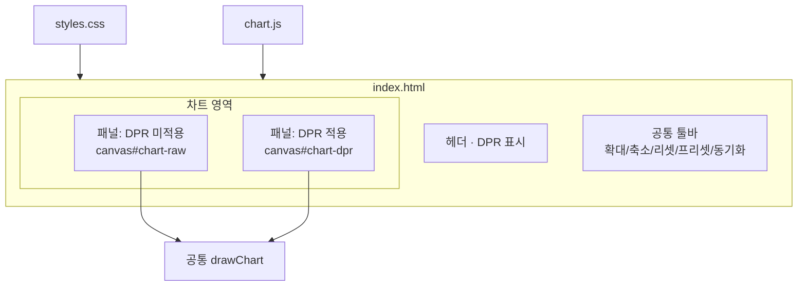
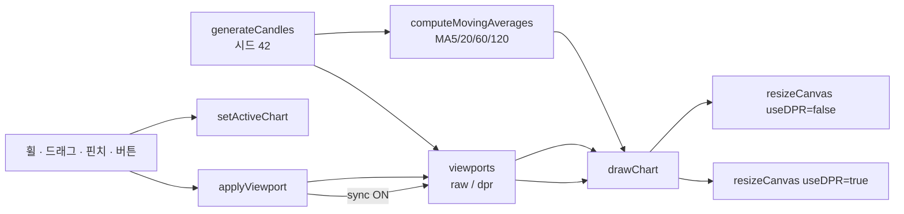
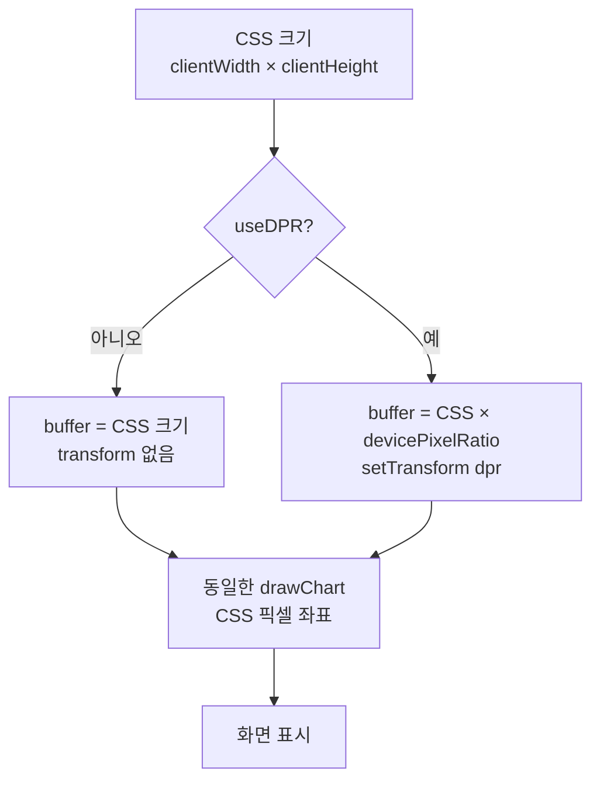

# 구현 사항

이 문서는 현재 코드베이스에 **실제로 들어가 있는 기능**을 정리한다.  
초기 요구·설계는 [스펙](../SPEC.md), 구현 단계는 [구현 계획](../IMPLEMENTATION.md)을 참고한다.

---

## 1. 한눈에 보기

| 항목 | 상태 |
|------|------|
| 바닐라 HTML5 Canvas 캔들 차트 | 완료 |
| DPR 미적용 / 적용 나란히 비교 | 완료 |
| 가짜 OHLC 2,000개 (시드 42) | 완료 |
| 줌·팬·핀치·버튼 | 완료 |
| 보이는 구간 최고가·최저가 | 완료 |
| 가격축·시간축 (줌 연동) | 완료 |
| 독립 조작 + 동기화 + 지금 맞추기 | 완료 |
| 반응형 레이아웃·전체 폭 사용 | 완료 |
| 한글 UI | 완료 |
| 이동평균 MA5 / 20 / 60 / 120 | 완료 (스펙 이후 추가) |

---

## 2. 기술 구성

| 파일 | 역할 |
|------|------|
| `index.html` | 페이지 골격, 공통/로컬 컨트롤, 캔버스 2개 |
| `styles.css` | 전체 폭 레이아웃, 반응형, 차트 높이 |
| `chart.js` | 데이터·DPR·렌더·제스처·동기화·이평선 |

- 빌드 도구·npm 의존성·차트 라이브러리 없음
- HTML5 `<canvas>` + `CanvasRenderingContext2D`
- 브라우저에서 `index.html`을 열면 동작

### 구조도

#### 페이지 · 파일



#### 런타임 데이터 흐름



#### DPR 처리 분기



---

## 3. DPR 비교 (핵심)

공통 `drawChart`로 그리고, 차이는 버퍼 준비만 다름.

**DPR 미적용**

- `canvas.width / height` = CSS 픽셀 크기
- `setTransform` 없음
- HiDPI에서 확대 보간 → 글자·선이 흐릴 수 있음

**DPR 적용**

- `dpr = devicePixelRatio`
- `canvas.width = cssWidth * dpr` (height 동일)
- `ctx.setTransform(dpr, 0, 0, dpr, 0, 0)`
- 이후 좌표·폰트는 CSS 픽셀 기준으로 동일하게 작성

상단에 `현재 devicePixelRatio: n` 표시.  
`n === 1`이면 두 차트 차이가 거의 없을 수 있다.

---

## 4. 차트·데이터

### 데이터

- 랜덤 워크 가짜 분봉 **2,000개**
- 시드 **42** (새로고침해도 동일)
- 시작: `Date.UTC(2024, 0, 1, 9, 0, 0)`, 1분 간격
- OHLC 제약: `high ≥ max(o,c)`, `low ≤ min(o,c)`

### 초기 뷰·프리셋

- 시작: 최근 **500개**
- 버튼: `500개`, `40개`, `리셋`(500개 복귀)
- 줌 범위: 최소 약 20개 ~ 최대 전체(2,000)

### 렌더 요소

- 상승(녹) / 하락(빨) 캔들
- 보이는 구간 **최고가·최저가** 가이드 라인 + 해당 봉 위/아래 라벨
- 오른쪽 가격축, 아래 시간축 (nice ticks, 줌에 따라 밀도·포맷 변경)
- 종가 단순이동평균: **MA5, MA20, MA60, MA120** + 범례

---

## 5. 조작

| 입력 | 동작 |
|------|------|
| 마우스 휠 | 커서 기준 확대·축소 |
| 상하 드래그 | 확대·축소 (위=확대, 아래=축소) |
| 좌우 드래그 | 팬 |
| 두 손가락 핀치 | 확대·축소 |
| Shift+드래그 / 영역 확대 모드 | 선택한 가로 구간으로 확대 |
| 실시간 (토글) | 마지막 봉 가격 틱 + 약 3초마다 새 분봉 |
| 확대 / 축소 / 리셋 / 500개 / 40개 | 버튼 줌·프리셋 |

제스처: 약 8px 이동 후 pan/zoom 락 (대각선은 먼저 임계를 넘긴 축 우선).

### 활성 차트·동기화

- 기본 활성: **DPR 적용** 패널 (`조작 중` 배지)
- 공통 버튼은 활성 차트에 적용 (동기화 ON이면 양쪽)
- 패널별 로컬 확대·축소·리셋
- **동기화** 체크박스: 한쪽 뷰포트를 다른 쪽에 실시간 반영
- **지금 맞추기**: 활성 구간을 반대쪽에 1회 복사

뷰포트 변경은 `applyViewport` 단일 진입점으로 처리.

---

## 6. 레이아웃·반응형

- 페이지 `max-width` 제한 없음 → 화면 전체 폭 사용
- 넓은 화면: 좌우 2열 (미적용 | 적용)
- 좁은 화면(~900px 이하): 세로 스택
- 차트 높이: `clamp(480px, 100vh - 210px, 900px)` (모바일은 별도 clamp)
- 차트 영역 `touch-action: none` (제스처와 페이지 스크롤 분리)
- `ResizeObserver` + DPR 변경 감지 시 버퍼·다시 그리기

---

## 7. UI 문구 (한글)

- 제목: Canvas HiDPI 캔들 차트 비교
- 안내: 확대해 최고가·최저가 글자의 선명도를 비교해 보세요.
- 패널: DPR 미적용 / DPR 적용
- 버튼: 확대, 축소, 리셋, 500개, 40개, 동기화, 지금 맞추기

---

## 8. 스펙 대비 변경·추가

초기 [스펙](../SPEC.md)에서 제외했던 항목 중 이후 추가된 것:

| 항목 | 비고 |
|------|------|
| 이동평균선 | MA5 / 20 / 60 / 120 |
| 레이아웃 폭·높이 | 전체 폭 + 뷰포트 기준 차트 높이로 확대 |

구현 계획의 Phase 1~8 범위(골격·데이터·렌더·제스처·동기화·리사이즈)는 반영 완료.

---

## 9. 로컬 실행

```bash
open index.html
# 또는
npx --yes serve .
```

배포(GitHub Pages 등) 시에도 정적 파일만 올리면 모바일·데스크톱에서 동일하게 확인 가능하다.
